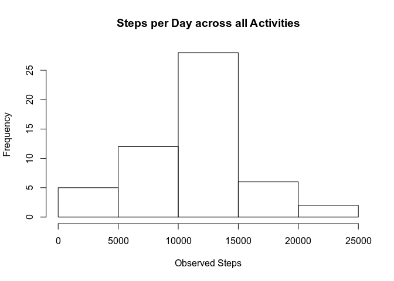
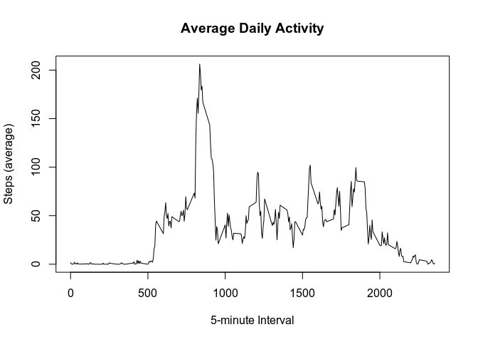
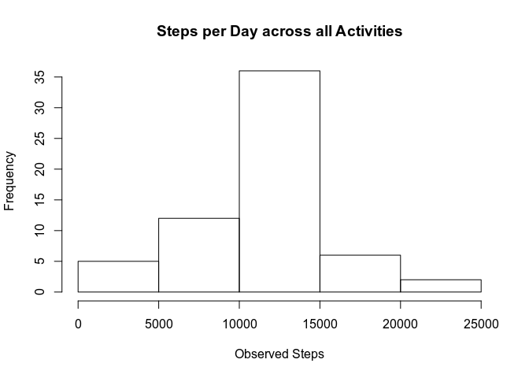
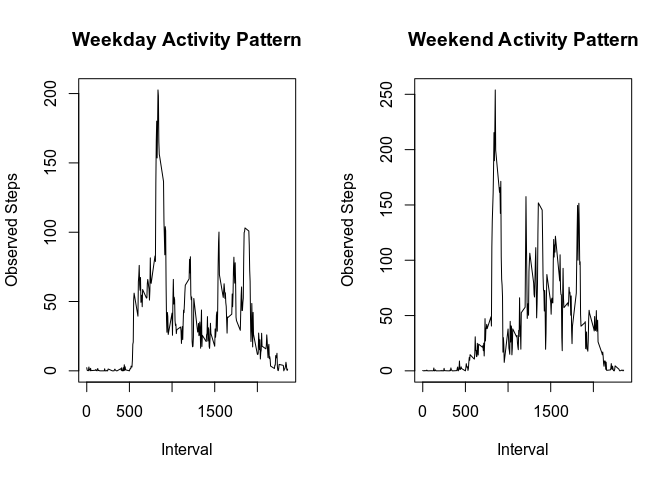

## Loading and preprocessing the data
Get the current working directory path 

```r
path <- getwd()
```
 Download the source file from the assignment

```r
download.file(url = "https://d396qusza40orc.cloudfront.net/repdata%2Fdata%2Factivity.zip", destfile = paste(path, "activity.zip", sep = "/"))
```

Unzip the database into its native .csv format

```r
unzip(zipfile = "activity.zip")
```

Load the monitoring data into an object named "activity", noting that headers are present

```r
activity <-read.csv("activity.csv", header = TRUE)
```
  

## What is mean total number of steps taken per day?
Summary of activity

```r
summary(activity)
```

```
##      steps                date          interval     
##  Min.   :  0.00   2012-10-01:  288   Min.   :   0.0  
##  1st Qu.:  0.00   2012-10-02:  288   1st Qu.: 588.8  
##  Median :  0.00   2012-10-03:  288   Median :1177.5  
##  Mean   : 37.38   2012-10-04:  288   Mean   :1177.5  
##  3rd Qu.: 12.00   2012-10-05:  288   3rd Qu.:1766.2  
##  Max.   :806.00   2012-10-06:  288   Max.   :2355.0  
##  NA's   :2304     (Other)   :15840
```

Creating an object that sums steps per day across all activities

```r
spd <- tapply(activity$steps, activity$date, sum)
```
**Calculate the total number of steps taken per day**

```r
spd
```

```
## 2012-10-01 2012-10-02 2012-10-03 2012-10-04 2012-10-05 2012-10-06 
##         NA        126      11352      12116      13294      15420 
## 2012-10-07 2012-10-08 2012-10-09 2012-10-10 2012-10-11 2012-10-12 
##      11015         NA      12811       9900      10304      17382 
## 2012-10-13 2012-10-14 2012-10-15 2012-10-16 2012-10-17 2012-10-18 
##      12426      15098      10139      15084      13452      10056 
## 2012-10-19 2012-10-20 2012-10-21 2012-10-22 2012-10-23 2012-10-24 
##      11829      10395       8821      13460       8918       8355 
## 2012-10-25 2012-10-26 2012-10-27 2012-10-28 2012-10-29 2012-10-30 
##       2492       6778      10119      11458       5018       9819 
## 2012-10-31 2012-11-01 2012-11-02 2012-11-03 2012-11-04 2012-11-05 
##      15414         NA      10600      10571         NA      10439 
## 2012-11-06 2012-11-07 2012-11-08 2012-11-09 2012-11-10 2012-11-11 
##       8334      12883       3219         NA         NA      12608 
## 2012-11-12 2012-11-13 2012-11-14 2012-11-15 2012-11-16 2012-11-17 
##      10765       7336         NA         41       5441      14339 
## 2012-11-18 2012-11-19 2012-11-20 2012-11-21 2012-11-22 2012-11-23 
##      15110       8841       4472      12787      20427      21194 
## 2012-11-24 2012-11-25 2012-11-26 2012-11-27 2012-11-28 2012-11-29 
##      14478      11834      11162      13646      10183       7047 
## 2012-11-30 
##         NA
```


**Make a histogram of the total number of steps taken each day**

```r
hist(spd, xlab = "Observed Steps", main = "Steps per Day across all Activities")
```

<!-- -->

**Calculate and report the mean and median of the total number of steps taken per day**

```r
summary(spd)
```

```
##    Min. 1st Qu.  Median    Mean 3rd Qu.    Max.    NA's 
##      41    8841   10765   10766   13294   21194       8
```
Mean steps per day = 10766  
Median steps per day = 10765  

## What is the average daily activity pattern?
***Make a time series plot (i.e. type = 1) of the 5-minute interval (x-axis) and the average number of steps taken, averaged across all days (y-axis)**
  
Loading ggplot2, and creating an object named "spi" (Steps per Interval) calculated for the mean of steps per interval

```r
library(ggplot2)
spi <- tapply(activity$steps, activity$interval, mean, na.rm = TRUE)
```

Creating the time series plot

```r
plot((names(spi)),
     spi,
     xlab = "5-minute Interval",
     ylab = "Steps (average)",
     main = "Average Daily Activity",
     type = "l")
```

<!-- -->
  
**Which 5-minute interval, on average across all the days in the dataset, contains the maximum number of steps?**

```r
mi <- names(sort(spi, decreasing = TRUE [1]))
```

```r
head(mi)
```

```
## [1] "835" "840" "850" "845" "830" "820"
```

```r
summary(spi)
```

```
##    Min. 1st Qu.  Median    Mean 3rd Qu.    Max. 
##   0.000   2.486  34.113  37.383  52.835 206.170
```

The maximum number of steps observed across all days during a 5-minute interval = 206 rounded is attributable to activity "835"


## Imputing missing values

```r
summary(activity)
```

```
##      steps                date          interval     
##  Min.   :  0.00   2012-10-01:  288   Min.   :   0.0  
##  1st Qu.:  0.00   2012-10-02:  288   1st Qu.: 588.8  
##  Median :  0.00   2012-10-03:  288   Median :1177.5  
##  Mean   : 37.38   2012-10-04:  288   Mean   :1177.5  
##  3rd Qu.: 12.00   2012-10-05:  288   3rd Qu.:1766.2  
##  Max.   :806.00   2012-10-06:  288   Max.   :2355.0  
##  NA's   :2304     (Other)   :15840
```
The number of NA's in this dataset = 2304  

**Devise a strategy for filling in all of the missing values in the dataset. The strategy does not need to be sophisticated. For example, you could use the mean/median for that day, or the mean for that 5-minute interval, etc.**    

My strategy for filling in the missing data would be to use the average steps for that interval caculated across each observed day.     

**Create a new dataset that is equal to the original dataset but with the missing data filled in.**

```r
## Dividing "spi" by activity and inteval
activityspi <- split(activity, activity$interval)
# Subsititute NA's for the averages taken from spi, for each activity split from "activityspi"
for(i in 1:length(activityspi)){
    activityspi[[i]]$steps[is.na(activityspi[[i]]$steps)] <- spi[i]
}
## Storing averages in the new active database "activimp"
activimp <- do.call("rbind", activityspi)
activimp <- activimp[order(activimp$date), ]
```

Checking the new database "activimp" for NA values

```r
summary(activimp)
```

```
##      steps                date          interval     
##  Min.   :  0.00   2012-10-01:  288   Min.   :   0.0  
##  1st Qu.:  0.00   2012-10-02:  288   1st Qu.: 588.8  
##  Median :  0.00   2012-10-03:  288   Median :1177.5  
##  Mean   : 37.38   2012-10-04:  288   Mean   :1177.5  
##  3rd Qu.: 27.00   2012-10-05:  288   3rd Qu.:1766.2  
##  Max.   :806.00   2012-10-06:  288   Max.   :2355.0  
##                   (Other)   :15840
```
No NA values are observed

*Make a histogram of the total number of steps taken each day and Calculate and report the mean and median total number of steps taken per day.*

```r
## Creating a new object "spdi" (Steps per Day Imputed) to sum the steps per activity, this will be exactly the same as the first database
spdi <- tapply(activimp$steps, activimp$date, sum)
```

Creating the histogram

```r
## This will be exactly the same as the first histogram for the original database, this time using "spdi"
hist(spdi, xlab = "Observed Steps", main = "Steps per Day across all Activities")
```

<!-- -->


**Do these values differ from the estimates from the first part of the assignment?**

```r
summary(spd) ## with NA's
```

```
##    Min. 1st Qu.  Median    Mean 3rd Qu.    Max.    NA's 
##      41    8841   10765   10766   13294   21194       8
```

```r
summary(spdi) ## NA's replaced with averages
```

```
##    Min. 1st Qu.  Median    Mean 3rd Qu.    Max. 
##      41    9819   10766   10766   12811   21194
```
The mean did not change, and the median only advanced by one step.  The first and third quartiles did change significantly.  


**What is the impact of imputing missing data on the estimates of the total daily number of steps?**  
Imputing average values raised the overall recorded steps, but did not change the central tenancy of the data.


## Are there differences in activity patterns between weekdays and weekends?
**Create a new factor variable in the dataset with two levels – “weekday” and “weekend” indicating whether a given date is a weekday or weekend day.**

```r
require(lubridate)

## Creating a column "day" to house the day of the week vector: 1-7, weekdays are 1-5, weekends are 6-7
activimp$day <- wday(activimp$date, label = FALSE)

## Weekday subset
wd <- subset(activimp, day < 6)

## Weekend subset
we <- subset(activimp, day >= 6)
```


**Make a panel plot containing a time series plot (i.e. type="l") of the 5-minute interval (x-axis) and the average number of steps taken, averaged across all weekday days or weekend days (y-axis). See the README file in the GitHub repository to see an example of what this plot should look like using simulated data.**

Creating average steps per interval for weekday and weekend observations

```r
## Weekday steps per interval
spiwd <- tapply(wd$steps, wd$interval, mean)

## Weekend steps per interval
spiwe <- tapply(we$steps, we$interval, mean)
```

Summary of weekday and weekend Steps per Interval

```r
summary(spiwd)
```

```
##    Min. 1st Qu.  Median    Mean 3rd Qu.    Max. 
##   0.000   2.591  27.072  35.525  53.172 202.610
```

```r
summary(spiwe)
```

```
##    Min. 1st Qu.  Median    Mean 3rd Qu.    Max. 
##   0.000   1.756  25.191  42.190  65.789 253.952
```

Creating the plot

```r
## Using par to create a two column panel plot
par(mfrow = c(1,2))

## Weekday plot
plot(names(spiwd),
     spiwd,
     xlab = "Interval",
     ylab = "Observed Steps",
     main = "Weekday Activity Pattern",
     type = "l")

## Weekend plot
plot(names(spiwe),
     spiwe,
     xlab = "Interval",
     ylab = "Observed Steps",
     main = "Weekend Activity Pattern",
     type = "l")
```

<!-- -->

